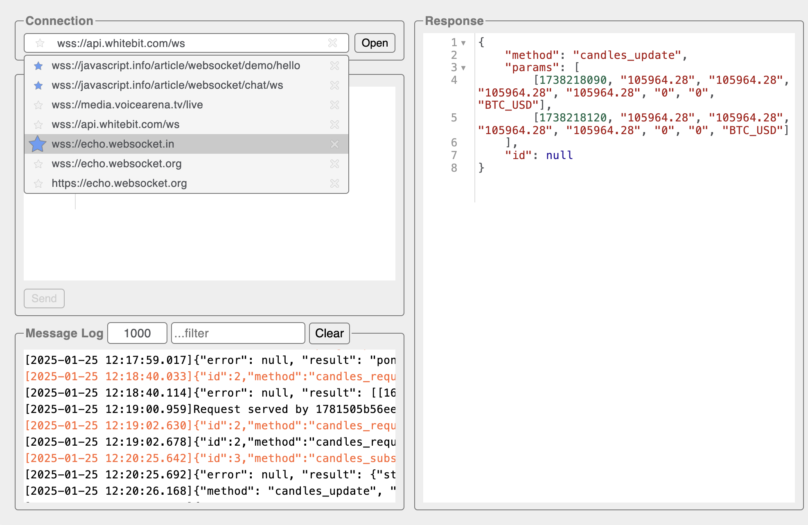

# Advanced WebSocket Client

[](https://opensource.org/licenses/MIT)

[](https://chrome.google.com/webstore/detail/advanced-websocket-client/lgimpnfdefcpkicbflpmainbcdnlblej)



Advanced WebSocket Client is a Google Chrome extension
designed to help construct custom WebSocket requests
and handle responses for directly testing your WebSocket services.

It supports the JSON request/response format,
and its main feature is that you don't have to strictly follow RFC formatting rules.
You can use single quotes, double quotes, or no quotes for string keys and values,
as well as trailing commas in object literals.

Additionally, it supports both single-line and block comments, just like in JavaScript.

Examples:
```javascript
{
    // double-quoted notation with a trailing coma
    "key1": "value1",
    "key2": "value2",
    // all comment lines will be automatically removed
    // before sending
}
````
```javascript
{
    // single-quoted notation
    'key1': 'value1'
}
```
```javascript
{
    // mixed notation
    key1: 'value1',
    'key2': "value2",
    "key3": 'value3',
    key4: [
        'item1',
        "item2", // trailing comma
    ], // trailing comma
}
```
## Shortcuts

### Request and Response editors
    F1 - fullscreen on/off
    F2 - line wrapping on/off
    Ctrl+Q - fold/unfold a code block
    Alt+Ctrl+J or Cmd+Ctrl+J - format JSON
    Cmd+/ or Ctrl+/ - comment/uncomment line/block
    
### Request editor
    Ctrl+Enter or Cmd+Enter - send a request

## Extension URL
https://chrome.google.com/webstore/detail/advanced-websocket-client/lgimpnfdefcpkicbflpmainbcdnlblej

## Contributors

- Oleksandr Miekh ([mekh](https://github.com/mekh))
        
## License

This software is released under the MIT License, see LICENSE.txt.
